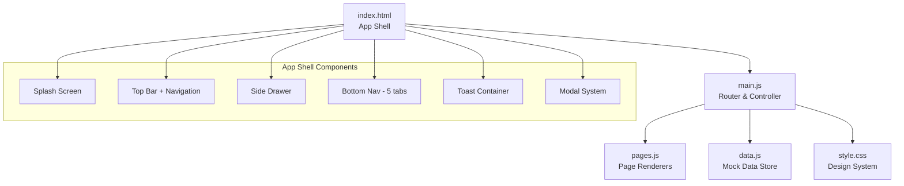
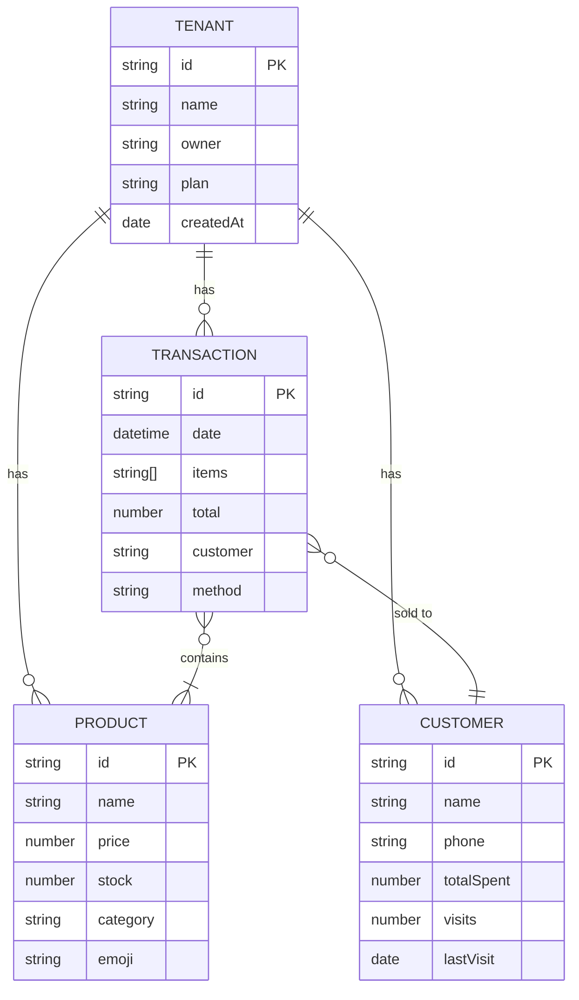

# 📘 POSAS — Blueprint & Product Requirements Document (PRD)

> **Platform Operasi Serbaguna untuk Semua**
> Dokumen ini adalah *single source of truth* untuk arsitektur, fitur, dan roadmap pengembangan POSAS.

---

## 1. Visi & Misi Produk

### Visi
Menjadi **platform manajemen bisnis all-in-one** yang paling mudah digunakan oleh pengusaha pemula di Indonesia — dari warung kopi hingga toko online.

### Misi
- Menyederhanakan operasional bisnis kecil lewat **satu aplikasi mobile-first**
- Menghilangkan barrier teknologi dengan UI yang **intuitif tanpa pelatihan**
- Menyediakan insight bisnis real-time untuk pengambilan keputusan yang lebih cerdas

### Problem Statement

| Masalah | Solusi POSAS |
|---------|-------------|
| Pencatatan manual rawan error | POS digital dengan kalkulasi otomatis |
| Tidak tahu produk mana yang laris | Dashboard analytics real-time |
| Kehilangan pelanggan karena tidak ada CRM | Manajemen pelanggan + riwayat belanja |
| Keuangan campur aduk | Laporan keuangan terstruktur otomatis |
| Banyak tools terpisah | Satu platform terintegrasi |

---

## 2. Target Pengguna

### Primary Persona
- **Nama**: Pengusaha Pemula Indonesia (UMKM)
- **Usia**: 20–45 tahun
- **Bisnis**: Warung makan, kafe, toko retail kecil, jasa
- **Tech Literacy**: Rendah–menengah (familiar smartphone, jarang pakai software bisnis)
- **Pain Point**: Butuh solusi simpel, murah, mobile-friendly

### Secondary Persona
- **Nama**: Pemilik bisnis berkembang
- **Kebutuhan**: Multi-outlet, tim management, laporan lanjutan
- **Target Tier**: Paket Pro / Enterprise

---

## 3. Tech Stack & Arsitektur

### 3.1 Current Stack (Frontend MVP)

| Layer | Teknologi | Versi |
|-------|-----------|-------|
| **Bundler** | Vite | ^8.0.10 |
| **Language** | Vanilla JavaScript (ES Modules) | ES2022+ |
| **Styling** | Vanilla CSS (Custom Properties) | — |
| **Typography** | Google Fonts — Inter | wght 300–900 |
| **Iconography** | Material Icons Round | — |
| **PWA Ready** | Meta tags configured | — |

### 3.2 Arsitektur Aplikasi



### 3.3 Pola Arsitektur

| Pattern | Implementasi |
|---------|-------------|
| **Routing** | Client-side SPA — hash-less page registry (`pages` object) |
| **Rendering** | String template literals → `innerHTML` injection |
| **State** | In-memory mutable object (`cart`, `data.js` exports) |
| **Events** | Manual DOM binding per page via `bindPageEvents()` |
| **UI Shell** | Fixed top bar + fixed bottom nav + slide drawer |
| **Modals** | Bottom-sheet pattern (slide-up dari bawah) |
| **Toasts** | Stack-based, auto-dismiss 3 detik |

---

## 4. Struktur File

```
posas/
├── index.html              # App shell (170 lines)
├── package.json            # Vite config
├── public/
│   ├── favicon.svg         # App icon
│   └── icons.svg           # Icon sprite
└── src/
    ├── main.js             # Router, nav, cart logic, event binding (317 lines)
    ├── pages.js            # 9 page renderers (398 lines)
    ├── data.js             # Mock data store + utilities (104 lines)
    ├── style.css           # Full design system (397 lines)
    └── assets/             # (empty — future static assets)
```

**Total codebase**: ~1,386 lines (eksklusif `node_modules`)

---

## 5. Inventaris Fitur (9 Modul)

### 5.1 🏠 Dashboard (`renderDashboard`)
**Status**: ✅ Implemented (UI)

| Komponen | Detail |
|----------|--------|
| Greeting | Sapaan personal + nama user |
| Stat Cards (2×2 grid) | Pendapatan hari ini, Pesanan, Total Pelanggan, Stok Menipis |
| Chart — Pendapatan Mingguan | Bar chart CSS-based, 7 hari |
| Transaksi Terakhir | 4 item terbaru, avatar + detail |
| Produk Terlaris | Top 3, emoji + harga + ranking |
| Navigation links | "Lihat Semua" → Finance, Products |

### 5.2 🧾 POS / Kasir (`renderPOS`)
**Status**: ✅ Implemented (Functional)

| Komponen | Detail |
|----------|--------|
| Search Bar | Real-time filter produk |
| Category Filter | Semua, Makanan, Minuman, Snack (scroll horizontal) |
| Product Grid | 2 kolom, emoji + nama + harga, tap-to-add |
| Cart Summary | Fixed bottom bar: count + total + tombol "Bayar" |
| Checkout Modal | Bottom-sheet: ringkasan item, pilih metode bayar (QRIS/Tunai), konfirmasi |
| Visual Feedback | Border glow + toast saat item ditambahkan |

**Cart Logic** (di `data.js`):
- `cart.add(product)` — increment qty jika sudah ada
- `cart.remove(productId)` — decrement / hapus
- `cart.clear()` — reset
- Computed: `cart.total`, `cart.count`

### 5.3 📦 Produk & Inventaris (`renderProducts`)
**Status**: ⚠️ Partial (UI only, add product = modal tanpa persistence)

| Komponen | Detail |
|----------|--------|
| Search Bar | Filter produk |
| Sort Button | UI only, belum fungsional |
| Product List | Card per produk: emoji, nama, kategori, harga, stok badge |
| Stock Badges | `badge-success` (≥20) / `badge-warning` (<20) |
| FAB | Floating "+" → modal tambah produk (4 field) |
| Add Product Modal | Nama, Harga, Stok Awal, Kategori — **tidak persist** |

### 5.4 👥 Pelanggan (`renderCustomers`)
**Status**: ⚠️ Partial (UI only)

| Komponen | Detail |
|----------|--------|
| Search Bar | Filter pelanggan |
| Customer List | Avatar (hash color), nama, telepon, kunjungan, total belanja |
| FAB | "+" → modal tambah pelanggan (3 field) — **tidak persist** |

### 5.5 💰 Keuangan (`renderFinance`)
**Status**: ⚠️ Partial (static data)

| Komponen | Detail |
|----------|--------|
| Summary Cards | Pemasukan (hijau) vs Pengeluaran (merah) |
| Riwayat Transaksi | Full list, avatar + customer + tanggal + metode + amount |

### 5.6 📅 Booking & Jadwal (`renderBooking`)
**Status**: 🚧 Placeholder (empty state)

### 5.7 🧾 Invoice (`renderInvoices`)
**Status**: 🚧 Placeholder (empty state)

### 5.8 📊 Laporan (`renderReports`)
**Status**: ⚠️ Partial (menu only, tidak ada data)

| Report | Detail |
|--------|--------|
| Laporan Penjualan | Harian, mingguan, bulanan |
| Laporan Inventaris | Stok masuk/keluar/opname |
| Laporan Pelanggan | Top customers + retensi |
| Laporan Keuangan | Laba rugi + arus kas |

### 5.9 ⚙️ Pengaturan (`renderSettings`)
**Status**: ⚠️ Partial (UI only, tidak ada action)

| Section | Item |
|---------|------|
| Profil User | Avatar, nama, email, role |
| Toko | Profil Toko, Tampilan, Struk & Nota, Metode Pembayaran |
| Akun | Tim & Akses, Keamanan, Bantuan |
| Upgrade | CTA "Upgrade ke Pro" |
| Actions | Logout button, version info |

---

## 6. Data Model

### 6.1 Entities (Mock — `data.js`)



### 6.2 Derived / Computed Data

| Object | Fields | Source |
|--------|--------|-------|
| `stats` | todayRevenue, todayOrders, totalProducts, totalCustomers, monthRevenue, lowStock | Computed dari entities |
| `weeklyRevenue` | Array of `{ day, amount }` × 7 | Hardcoded mock |
| `cart` | items[], total (getter), count (getter) | Runtime state |

### 6.3 Utility Functions

| Function | Signature | Purpose |
|----------|-----------|---------|
| `formatRupiah` | `(n: number) → string` | Format angka ke "Rp X.XXX" |
| `getInitials` | `(name: string) → string` | "Andi Pratama" → "AP" |
| `hashColor` | `(str: string) → string` | Deterministic color dari 8 palet |

---

## 7. Design System

### 7.1 Color Tokens

| Token | Value | Usage |
|-------|-------|-------|
| `--bg-primary` | `#0f172a` | Background utama (Slate 900) |
| `--bg-secondary` | `#1e293b` | Card, drawer (Slate 800) |
| `--bg-elevated` | `#334155` | Input, elevated surfaces (Slate 700) |
| `--bg-glass` | `rgba(30,41,59,0.85)` | Glassmorphism (top bar, bottom nav) |
| `--accent` | `#6366f1` | Primary brand (Indigo 500) |
| `--accent-light` | `#818cf8` | Accent text, active states |
| `--success` | `#22c55e` | Positive indicators |
| `--warning` | `#f59e0b` | Warning states |
| `--danger` | `#ef4444` | Destructive actions |
| `--info` | `#3b82f6` | Informational |

### 7.2 Typography

| Element | Size | Weight | Font |
|---------|------|--------|------|
| Page Title (H1) | 18px | 700 | Inter |
| Section Title | 16px | 700 | Inter |
| Stat Value | 24px | 800 | Inter |
| Body / List Title | 14px | 600 | Inter |
| Subtitle | 12–13px | 400–500 | Inter |
| Badge / Label | 10–11px | 600 | Inter |

### 7.3 Spacing & Radius (Progressive)

| Token | Value | Context |
|-------|-------|---------|
| `--radius-sm` | 8px | Buttons, badges, avatars |
| `--radius-md` | 14px | Inputs, POS cards |
| `--radius-lg` | 20px | Cards, search bars |
| `--radius-xl` | 28px | Modal (top corners) |

### 7.4 Elevation (Shadow System)

| Level | Value | Usage |
|-------|-------|-------|
| `--shadow-sm` | `0 1px 3px rgba(0,0,0,0.3)` | Subtle depth |
| `--shadow-md` | `0 4px 16px rgba(0,0,0,0.35)` | Cards |
| `--shadow-lg` | `0 8px 32px rgba(0,0,0,0.4)` | FAB, toasts |

### 7.5 Motion & Animation

| Animation | Duration | Easing | Usage |
|-----------|----------|--------|-------|
| `fadeIn` | 350ms | ease | Page transitions |
| `slideUp` | 350ms | cubic-bezier(0.4,0,0.2,1) | Content reveal |
| `modalUp` | 300ms | cubic-bezier(0.4,0,0.2,1) | Bottom-sheet modal |
| `splashPulse` | 1.5s loop | ease | Splash icon pulse |
| `shimmer` | 1.5s loop | linear | Skeleton loading |
| Button `:active` | 200ms | ease | Scale 0.9–0.96 |

### 7.6 Komponen UI Utama

| Komponen | File | CSS Class |
|----------|------|-----------|
| Top Bar (glass) | index.html | `.top-bar` |
| Bottom Nav (5 tab) | index.html | `.bottom-nav` |
| Side Drawer | index.html | `.side-drawer` |
| Stat Card | pages.js | `.stat-card` |
| List Item | pages.js | `.list-item` |
| POS Product Tile | pages.js | `.pos-product` |
| Cart Summary Bar | pages.js | `.cart-summary` |
| Search Bar | pages.js | `.search-bar` |
| Modal (Bottom Sheet) | main.js | `.modal` |
| Toast Notification | main.js | `.toast` |
| FAB | pages.js | `.btn-fab` |
| Badge | pages.js | `.badge` |
| Empty State | pages.js | `.empty-state` |

---

## 8. Penilaian Status Saat Ini

### ✅ Yang Sudah Baik
- Design system yang solid dan konsisten (dark theme, glassmorphism, progressive radius)
- Mobile-first shell yang lengkap (top bar, bottom nav, drawer, modal, toast)
- POS flow end-to-end berfungsi (browse → add → checkout → pay)
- Typography hierarchy yang jelas (Inter 300–900)
- Animasi & micro-interactions yang premium

### ⚠️ Yang Perlu Dikembangkan

| Area | Gap | Priority |
|------|-----|----------|
| ~~**Data Persistence**~~ | ~~Semua data in-memory~~ → ✅ localStorage | ~~🔴~~ ✅ Done |
| ~~**Authentication**~~ | ~~Tidak ada login/register~~ → ✅ Full Auth flow | ~~🔴~~ ✅ Done |
| **Multi-tenancy** | Tenant hardcoded, tidak ada isolasi | 🔴 Critical |
| ~~**CRUD Operations**~~ | ~~Add product/customer tidak persist~~ → ✅ Full CRUD | ~~🟠~~ ✅ Done |
| ~~**Form Validation**~~ | ~~Tidak ada validasi input~~ → ✅ Required fields + error msg | ~~🟠~~ ✅ Done |
| ~~**Reports**~~ | ~~Menu saja~~ → ✅ Analytics dashboard lengkap | ~~🟡~~ ✅ Done |
| ~~**Booking**~~ | ~~Empty state~~ → ✅ CRUD + status management | ~~🟡~~ ✅ Done |
| ~~**Invoice**~~ | ~~Empty state~~ → ✅ Create + status flow (Draft→Sent→Paid) | ~~🟡~~ ✅ Done |
| **Offline Support** | Tidak ada service worker | 🟡 Medium |
| **i18n** | Hardcoded bahasa Indonesia | 🟢 Low |

---

## 9. Roadmap Pengembangan

### Phase 1 — Foundation (Minggu 1–2)
> Membuat aplikasi **benar-benar fungsional**

- [ ] Integrasi backend (Supabase / Firebase)
- [ ] Authentication (login, register, reset password)
- [ ] Multi-tenant isolation (RLS / tenant middleware)
- [ ] CRUD persist: Products, Customers
- [ ] Form validation (semua modal input)
- [ ] Real cart persistence (localStorage fallback)

### Phase 2 — Core Business (Minggu 3–4)
> Fitur bisnis inti yang **menghasilkan value**

- [ ] Transaction history persist + query
- [ ] Finance: pemasukan vs pengeluaran real
- [ ] Reports: penjualan harian/mingguan/bulanan (chart.js atau lightweight)
- [ ] Invoice generator (PDF export)
- [ ] Stock management (stok masuk/keluar/opname)
- [ ] Receipt printing (thermal / PDF)

### Phase 3 — Growth Features (Minggu 5–6)
> Fitur yang **meningkatkan retensi**

- [ ] Booking & jadwal (kalender interaktif)
- [ ] Notifikasi real (stok menipis, pembayaran masuk)
- [ ] Customer loyalty program
- [ ] Multi-payment gateway (QRIS real, GoPay, OVO)
- [x] PWA + Service Worker (offline-first)
- [x] Export data (CSV/Excel)
- [x] Digital Receipt (PNG download & WhatsApp Share)

### Phase 4 — Scale (Minggu 7+)
> Fitur untuk **scaling bisnis**

- [ ] Multi-outlet support
- [x] Team management (roles: Owner, Kasir, Manajer)
- [x] Advanced analytics (Chart.js)
- [x] Subscription billing (Free → Pro)
- [x] Bulk product import (CSV)
- [ ] API public untuk integrasi
- [ ] White-label / custom branding

---

## 10. Pricing Model (Rencana)

| Paket | Harga | Fitur |
|-------|-------|-------|
| **Gratis** | Rp 0 | 1 outlet, 50 produk, POS, laporan dasar |
| **Pro** | ~Rp 99.000/bln | Unlimited produk, invoice, booking, multi-payment |
| **Enterprise** | Custom | Multi-outlet, team, API, white-label |

---

## 11. Metric Keberhasilan (KPI)

| Metric | Target (3 bulan) |
|--------|-----------------|
| Monthly Active Users | 500+ |
| Daily Active Users | 150+ |
| Transaksi/hari per user | ≥ 10 |
| Conversion Free → Pro | ≥ 5% |
| Churn Rate | < 8% |
| App Load Time | < 2 detik |
| Crash Rate | < 0.1% |

---

> **Dokumen ini adalah living document.** Update setiap kali ada perubahan arsitektur, fitur, atau prioritas.
>
> *Last updated: 2026-05-10 • v1.0.0*
