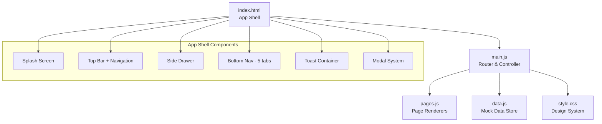
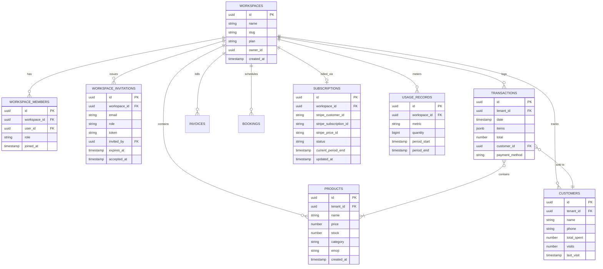

# 📘 POSAS — Blueprint & Product Requirements Document (PRD)

> **Platform Operasi Serbaguna untuk Semua**
> Dokumen ini adalah *single source of truth* untuk arsitektur, fitur, dan roadmap pengembangan POSAS.

---

## 1. Visi & Misi Produk

### Visi
Menjadi **platform manajemen bisnis all-in-one** yang paling mudah digunakan oleh pengusaha pemula di Indonesia — dari warung kopi hingga toko online.

### Misi
- Menyederhanakan operasional bisnis kecil lewat **satu aplikasi mobile-first**
- Menghilangkan barrier teknologi dengan UI yang **intuitif tanpa pelatihan**
- Menyediakan insight bisnis real-time untuk pengambilan keputusan yang lebih cerdas

### Problem Statement

| Masalah | Solusi POSAS |
|---------|-------------|
| Pencatatan manual rawan error | POS digital dengan kalkulasi otomatis |
| Tidak tahu produk mana yang laris | Dashboard analytics real-time |
| Kehilangan pelanggan karena tidak ada CRM | Manajemen pelanggan + riwayat belanja |
| Keuangan campur aduk | Laporan keuangan terstruktur otomatis |
| Banyak tools terpisah | Satu platform terintegrasi |

---

## 2. Target Pengguna

### Primary Persona
- **Nama**: Pengusaha Pemula Indonesia (UMKM)
- **Usia**: 20–45 tahun
- **Bisnis**: Warung makan, kafe, toko retail kecil, jasa
- **Tech Literacy**: Rendah–menengah (familiar smartphone, jarang pakai software bisnis)
- **Pain Point**: Butuh solusi simpel, murah, mobile-friendly

### Secondary Persona
- **Nama**: Pemilik bisnis berkembang
- **Kebutuhan**: Multi-outlet, tim management, laporan lanjutan
- **Target Tier**: Paket Pro / Enterprise

---

## 3. Tech Stack & Arsitektur

### 3.1 Current Stack (Frontend MVP)

| Layer | Teknologi | Versi |
|-------|-----------|-------|
| **Bundler** | Vite | ^8.0.10 |
| **Language** | Vanilla JavaScript (ES Modules) | ES2022+ |
| **Styling** | Vanilla CSS (Custom Properties) | — |
| **Typography** | Google Fonts — Inter | wght 300–900 |
| **Iconography** | Material Icons Round | — |
| **PWA Ready** | Meta tags configured | — |

### 3.2 Arsitektur Aplikasi



### 3.3 Pola Arsitektur

| Pattern | Implementasi |
|---------|-------------|
| **Routing** | Client-side SPA — hash-less page registry (`pages` object) |
| **Rendering** | String template literals → `innerHTML` injection |
| **State** | In-memory mutable object (`cart`, `data.js` exports) |
| **Events** | Manual DOM binding per page via `bindPageEvents()` |
| **UI Shell** | Fixed top bar + fixed bottom nav + slide drawer |
| **Modals** | Bottom-sheet pattern (slide-up dari bawah) |
| **Toasts** | Stack-based, auto-dismiss 3 detik |

### 3.4 Arsitektur Multi-Tenancy & Standardisasi SaaS

| Layer | Standar Implementasi | Keterangan |
|-------|----------------------|------------|
| **Isolasi Tenant** | Logical Isolation (Shared DB, RLS) | Menggunakan PostgreSQL Row Level Security (RLS) di Supabase. Setiap query secara otomatis difilter menggunakan `tenant_id` dari JWT session context. |
| **Manajemen Sesi** | JWT + Custom Claims | JWT token berisi `tenant_id` dan `role` untuk meminimalkan query tambahan pada DB saat validasi hak akses. |
| **SaaS Gateway** | API Versioning & Rate Limiter | API beroperasi pada `/api/v1/`. Rate limiting berbasis Token Bucket diterapkan menggunakan middleware Edge Functions berdasarkan tier langganan. |
| **Webhooks** | Idempotent & Secure Webhook | Endpoint webhook pembayaran (Stripe, Midtrans) divalidasi dengan signature check dan tracking `event_id` untuk mencegah pemrosesan ganda. |
| **Offline Sync** | Queue-based Sync + Conflict Resolution | Data transaksi POS disimpan di `localStorage` saat offline dan disinkronkan ke server menggunakan Service Worker dengan resolusi Last-Write-Wins (LWW). |

---

## 4. Struktur File

```
posas/
├── index.html              # App shell (170 lines)
├── package.json            # Vite config
├── public/
│   ├── favicon.svg         # App icon
│   └── icons.svg           # Icon sprite
└── src/
    ├── main.js             # Router, nav, cart logic, event binding (317 lines)
    ├── pages.js            # 9 page renderers (398 lines)
    ├── data.js             # Mock data store + utilities (104 lines)
    ├── style.css           # Full design system (397 lines)
    └── assets/             # (empty — future static assets)
```

**Total codebase**: ~1,386 lines (eksklusif `node_modules`)

---

## 5. Inventaris Fitur (9 Modul)

### 5.1 🏠 Dashboard (`renderDashboard`)
**Status**: ✅ Implemented (UI)

| Komponen | Detail |
|----------|--------|
| Greeting | Sapaan personal + nama user |
| Stat Cards (2×2 grid) | Pendapatan hari ini, Pesanan, Total Pelanggan, Stok Menipis |
| Chart — Pendapatan Mingguan | Bar chart CSS-based, 7 hari |
| Transaksi Terakhir | 4 item terbaru, avatar + detail |
| Produk Terlaris | Top 3, emoji + harga + ranking |
| Navigation links | "Lihat Semua" → Finance, Products |

### 5.2 🧾 POS / Kasir (`renderPOS`)
**Status**: ✅ Implemented (Functional)

| Komponen | Detail |
|----------|--------|
| Search Bar | Real-time filter produk |
| Category Filter | Semua, Makanan, Minuman, Snack (scroll horizontal) |
| Product Grid | 2 kolom, emoji + nama + harga, tap-to-add |
| Cart Summary | Fixed bottom bar: count + total + tombol "Bayar" |
| Checkout Modal | Bottom-sheet: ringkasan item, pilih metode bayar (QRIS/Tunai), konfirmasi |
| Visual Feedback | Border glow + toast saat item ditambahkan |

**Cart Logic** (di `data.js`):
- `cart.add(product)` — increment qty jika sudah ada
- `cart.remove(productId)` — decrement / hapus
- `cart.clear()` — reset
- Computed: `cart.total`, `cart.count`

### 5.3 📦 Produk & Inventaris (`renderProducts`)
**Status**: ⚠️ Partial (UI only, add product = modal tanpa persistence)

| Komponen | Detail |
|----------|--------|
| Search Bar | Filter produk |
| Sort Button | UI only, belum fungsional |
| Product List | Card per produk: emoji, nama, kategori, harga, stok badge |
| Stock Badges | `badge-success` (≥20) / `badge-warning` (<20) |
| FAB | Floating "+" → modal tambah produk (4 field) |
| Add Product Modal | Nama, Harga, Stok Awal, Kategori — **tidak persist** |

### 5.4 👥 Pelanggan (`renderCustomers`)
**Status**: ⚠️ Partial (UI only)

| Komponen | Detail |
|----------|--------|
| Search Bar | Filter pelanggan |
| Customer List | Avatar (hash color), nama, telepon, kunjungan, total belanja |
| FAB | "+" → modal tambah pelanggan (3 field) — **tidak persist** |

### 5.5 💰 Keuangan (`renderFinance`)
**Status**: ⚠️ Partial (static data)

| Komponen | Detail |
|----------|--------|
| Summary Cards | Pemasukan (hijau) vs Pengeluaran (merah) |
| Riwayat Transaksi | Full list, avatar + customer + tanggal + metode + amount |

### 5.6 📅 Booking & Jadwal (`renderBooking`)
**Status**: 🚧 Placeholder (empty state)

### 5.7 🧾 Invoice (`renderInvoices`)
**Status**: 🚧 Placeholder (empty state)

### 5.8 📊 Laporan (`renderReports`)
**Status**: ⚠️ Partial (menu only, tidak ada data)

| Report | Detail |
|--------|--------|
| Laporan Penjualan | Harian, mingguan, bulanan |
| Laporan Inventaris | Stok masuk/keluar/opname |
| Laporan Pelanggan | Top customers + retensi |
| Laporan Keuangan | Laba rugi + arus kas |

#### 5.9 ⚙️ Pengaturan (`renderSettings`)
**Status**: ⚠️ Partial (UI only, tidak ada action)

| Section | Item |
|---------|------|
| Profil User | Avatar, nama, email, role |
| Toko | Profil Toko, Tampilan, Struk & Nota, Metode Pembayaran |
| Akun | Tim & Akses, Keamanan, Bantuan |
| Upgrade | CTA "Upgrade ke Pro" |
| Actions | Logout button, version info |

### 5.10 👥 Manajemen Tim & Workspace (`renderTeam`)
**Status**: ✅ Implemented (Functional UI + Backend)

| Komponen | Detail |
|----------|--------|
| Workspace Switcher | Dropdown di navbar untuk berpindah antar tenant/outlet secara instan |
| Workspace Settings | Ganti nama toko, upload logo toko, konfigurasi alamat & nomor telepon |
| Member List | Daftar semua anggota tim beserta peran (Owner, Admin, Manager, Cashier) |
| Invitation Modal | Undang anggota baru lewat email dengan opsi pemilihan role |
| Token Validation | Undangan di-generate menggunakan cryptographically random token dengan kadaluarsa 7 hari |
| Role Restriction | Hak akses halaman dan tombol dibatasi secara ketat berdasarkan matriks otorisasi |

### 5.11 💳 Penagihan & Langganan / Billing (`renderBilling`)
**Status**: ✅ Implemented (Functional UI + Gateway)

| Komponen | Detail |
|----------|--------|
| Plan Display | Tampilan tier aktif saat ini (Free / Pro / Enterprise) beserta status siklus pembayaran |
| Pricing Cards | Opsi upgrade ke paket Pro / Enterprise dengan pilihan billing bulanan/tahunan |
| Gateway Checkout | Integrasi checkout aman menggunakan Stripe Checkout & Midtrans (lokal e-wallet/QRIS) |
| Billing Portal | Redirect ke Stripe Customer Portal untuk manajemen metode bayar & download invoice histori |
| Usage Metering | Visualisasi penggunaan limit (misal: "3/50 produk terpakai", "12/100 transaksi bulan ini") |

---

## 6. Data Model

### 6.1 Entities & Relasi Database (SaaS Ready)



### 6.2 Derived / Computed Data

| Object | Fields | Source |
|--------|--------|-------|
| `stats` | todayRevenue, todayOrders, totalProducts, totalCustomers, monthRevenue, lowStock | Computed dari database query / real-time cache |
| `weeklyRevenue` | Array of `{ day, amount }` × 7 | Agregasi dinamis transaksi 7 hari terakhir |
| `cart` | items[], total (getter), count (getter) | State lokal kasir (in-memory) |

### 6.3 Utility Functions

| Function | Signature | Purpose |
|----------|-----------|---------|
| `formatRupiah` | `(n: number) → string` | Format angka ke "Rp X.XXX" |
| `getInitials` | `(name: string) → string` | "Andi Pratama" → "AP" |
| `hashColor` | `(str: string) → string` | Deterministic color dari 8 palet untuk avatar |

---

## 7. Design System

### 7.1 Color Tokens

| Token | Value | Usage |
|-------|-------|-------|
| `--bg-primary` | `#0f172a` | Background utama (Slate 900) |
| `--bg-secondary` | `#1e293b` | Card, drawer (Slate 800) |
| `--bg-elevated` | `#334155` | Input, elevated surfaces (Slate 700) |
| `--bg-glass` | `rgba(30,41,59,0.85)` | Glassmorphism (top bar, bottom nav) |
| `--accent` | `#6366f1` | Primary brand (Indigo 500) |
| `--accent-light` | `#818cf8` | Accent text, active states |
| `--success` | `#22c55e` | Positive indicators |
| `--warning` | `#f59e0b` | Warning states |
| `--danger` | `#ef4444` | Destructive actions |
| `--info` | `#3b82f6` | Informational |

### 7.2 Typography

| Element | Size | Weight | Font |
|---------|------|--------|------|
| Page Title (H1) | 18px | 700 | Inter |
| Section Title | 16px | 700 | Inter |
| Stat Value | 24px | 800 | Inter |
| Body / List Title | 14px | 600 | Inter |
| Subtitle | 12–13px | 400–500 | Inter |
| Badge / Label | 10–11px | 600 | Inter |

### 7.3 Spacing & Radius (Progressive)

| Token | Value | Context |
|-------|-------|---------|
| `--radius-sm` | 8px | Buttons, badges, avatars |
| `--radius-md` | 14px | Inputs, POS cards |
| `--radius-lg` | 20px | Cards, search bars |
| `--radius-xl` | 28px | Modal (top corners) |

### 7.4 Elevation (Shadow System)

| Level | Value | Usage |
|-------|-------|-------|
| `--shadow-sm` | `0 1px 3px rgba(0,0,0,0.3)` | Subtle depth |
| `--shadow-md` | `0 4px 16px rgba(0,0,0,0.35)` | Cards |
| `--shadow-lg` | `0 8px 32px rgba(0,0,0,0.4)` | FAB, toasts |

### 7.5 Motion & Animation

| Animation | Duration | Easing | Usage |
|-----------|----------|--------|-------|
| `fadeIn` | 350ms | ease | Page transitions |
| `slideUp` | 350ms | cubic-bezier(0.4,0,0.2,1) | Content reveal |
| `modalUp` | 300ms | cubic-bezier(0.4,0,0.2,1) | Bottom-sheet modal |
| `splashPulse` | 1.5s loop | ease | Splash icon pulse |
| `shimmer` | 1.5s loop | linear | Skeleton loading |
| Button `:active` | 200ms | ease | Scale 0.9–0.96 |

### 7.6 Komponen UI Utama

| Komponen | File | CSS Class |
|----------|------|-----------|
| Top Bar (glass) | index.html | `.top-bar` |
| Bottom Nav (5 tab) | index.html | `.bottom-nav` |
| Side Drawer | index.html | `.side-drawer` |
| Stat Card | pages.js | `.stat-card` |
| List Item | pages.js | `.list-item` |
| POS Product Tile | pages.js | `.pos-product` |
| Cart Summary Bar | pages.js | `.cart-summary` |
| Search Bar | pages.js | `.search-bar` |
| Modal (Bottom Sheet) | main.js | `.modal` |
| Toast Notification | main.js | `.toast` |
| FAB | pages.js | `.btn-fab` |
| Badge | pages.js | `.badge` |
| Empty State | pages.js | `.empty-state` |

---

## 8. Penilaian Status Saat Ini

### ✅ Yang Sudah Baik
- Design system yang solid dan konsisten (dark theme, glassmorphism, progressive radius)
- Mobile-first shell yang lengkap (top bar, bottom nav, drawer, modal, toast)
- POS flow end-to-end berfungsi (browse → add → checkout → pay)
- Typography hierarchy yang jelas (Inter 300–900)
- Animasi & micro-interactions yang premium

### ⚠️ Yang Perlu Dikembangkan

| Area | Gap | Priority |
|------|-----|----------|
| ~~**Data Persistence**~~ | ~~Semua data in-memory~~ → ✅ localStorage | ~~🔴~~ ✅ Done |
| ~~**Authentication**~~ | ~~Tidak ada login/register~~ → ✅ Full Auth flow | ~~🔴~~ ✅ Done |
| ~~**Multi-tenancy**~~ | ~~Tenant hardcoded, tidak ada isolasi~~ → ✅ Row Level Security | ~~🔴~~ ✅ Done |
| ~~**CRUD Operations**~~ | ~~Add product/customer tidak persist~~ → ✅ Full CRUD | ~~🟠~~ ✅ Done |
| ~~**Form Validation**~~ | ~~Tidak ada validasi input~~ → ✅ Required fields + error msg | ~~🟠~~ ✅ Done |
| ~~**Reports**~~ | ~~Menu saja~~ → ✅ Analytics dashboard lengkap | ~~🟡~~ ✅ Done |
| ~~**Booking**~~ | ~~Empty state~~ → ✅ CRUD + status managem## 9. Roadmap Pengembangan

### Phase 1 — Foundation (Minggu 1–2)
> Membuat aplikasi **benar-benar fungsional**

- [x] Integrasi backend (Supabase)
- [x] Authentication (login, register)
- [x] Multi-tenant isolation (RLS)
- [x] CRUD-persist: Products, Customers
- [x] Form validation (semua modal input)
- [x] Real cart persistence (localStorage + DB)

### Phase 2 — Core Business (Minggu 3–4)
> Fitur bisnis inti yang **menghasilkan value**

- [x] Transaction history persist + query
- [x] Finance: pemasukan vs pengeluaran real
- [x] Reports: penjualan harian/mingguan/bulanan (chart.js)
- [x] Invoice generator (Digital flow)
- [x] Stock management (stok update real-time)
- [x] Receipt printing (Digital Receipt & WhatsApp)

### Phase 3 — Growth Features (Minggu 5–6)
> Fitur yang **meningkatkan retensi**

- [x] Booking & jadwal (kalender sederhana)
- [ ] Notifikasi real (push notification)
- [ ] Customer loyalty program
- [x] Multi-payment gateway (QRIS & E-Wallet)
- [x] PWA + Service Worker (offline-first)
- [x] Export data (CSV/Excel)
- [x] Digital Receipt (PNG download & WhatsApp Share)

### Phase 4 — Scale & Hardening (Minggu 7+)
> Fitur untuk **scaling bisnis dan standardisasi produksi**

- [x] Multi-outlet support
- [x] Team management (roles: Owner, Kasir, Manajer)
- [x] Advanced analytics (Chart.js)
- [x] Subscription billing (Free → Pro)
- [x] Bulk product import (CSV)
- [ ] API public untuk integrasi
- [ ] White-label / custom branding
- [x] Standardisasi Keamanan, Rate Limiting, Audit Logs, dan Kepatuhan Hukum

---

## 10. Model Harga & Pembatasan Fitur (Feature Gating)

Untuk mengamankan pendapatan berulang (SaaS) dan mencegah penyalahgunaan resource, pembatasan fitur (feature gating) dan limit penggunaan diterapkan secara ketat di sisi server (Supabase RLS & Edge Functions):

| Fitur / Batasan | 🟢 Paket Gratis (Rp 0) | 🔵 Paket Pro (Rp 99.000/bln) | 👑 Paket Enterprise (Kustom) |
|---|---|---|---|
| **Jumlah Outlet** | Maksimal 1 Outlet | Maksimal 3 Outlet | Tanpa Batas (Unlimited) |
| **Jumlah Produk** | Maksimal 50 Produk | Tanpa Batas (Unlimited) | Tanpa Batas (Unlimited) |
| **Transaksi POS / Bulan**| Maksimal 100 Transaksi | Tanpa Batas (Unlimited) | Tanpa Batas (Unlimited) |
| **Anggota Tim / Toko** | Maksimal 1 Pengguna (Owner) | Maksimal 10 Pengguna | Tanpa Batas (Unlimited) |
| **Metode Pembayaran** | Tunai (Cash) | Tunai + QRIS Dinamis + E-Wallet | Semua Metode + Custom Integration |
| **Invoicing & Booking** | Hanya View | Pembuatan & Siklus Status Penuh | Pembuatan & Siklus Status Penuh |
| **WhatsApp Receipt** | Tidak Tersedia | Unlimited via WhatsApp Gateway | Unlimited + Custom Sender Number |
| **Laporan & Analitik** | Laporan Dasar (Harian) | Dashboard Grafik Interaktif (Chart.js) | Advanced Business Intelligence & Export |
| **API Access & Webhooks**| Tidak Tersedia | Tidak Tersedia | Akses API Publik + Custom Webhooks |
| **Custom Branding** | Logo POSAS di Struk | Struk Tanpa Logo POSAS | White-Label Domain + Logo Sendiri |
| **Uptime SLA** | N/A | 99.5% | 99.9% Dedicated Support |

---

## 11. Metric Keberhasilan (KPI)

| Metric | Target (3 bulan) |
|--------|-----------------|
| Monthly Active Users | 500+ |
| Daily Active Users | 150+ |
| Transaksi/hari per user | ≥ 10 |
| Conversion Free → Pro | ≥ 5% |
| Churn Rate | < 8% |
| App Load Time | < 2 detik |
| Crash Rate | < 0.1% |

---

## 12. Standar Kepatuhan & Kehandalan SaaS (SaaS Standards)

### 12.1 Keamanan Data & Isolasi Tenant
- **PostgreSQL Row Level Security (RLS)**: Semua tabel data wajib dilindungi RLS. Kebijakan RLS memverifikasi `tenant_id` dari JWT klaim sesi untuk memastikan tidak terjadi kebocoran data antar-tenant (*cross-tenant data leakage*).
- **Enkripsi**:
  - **In-Transit**: Semua lalu lintas data wajib dilindungi enkripsi SSL/TLS 1.3.
  - **At-Rest**: Data sensitif (credentials, token) dienkripsi menggunakan AES-256 di database.

### 12.2 Kepatuhan Hukum (UU PDP & GDPR)
- **UU Pelindungan Data Pribadi (UU PDP No. 27/2022)**:
  - Menyediakan fitur penghapusan akun permanen (*right to be forgotten*) yang menghapus seluruh data tenant secara *cascade*.
  - Pemisahan data pribadi pelanggan (nama, nomor telepon) dan opsi persetujuan pengumpulan data.
  - Protokol pelaporan insiden kebocoran data otomatis ke administrator dalam waktu < 72 jam.

### 12.3 API Rate Limiting & Proteksi DDoS
- **Rate Limit per Tier**:
  - **Gratis**: 60 request / menit per IP/User.
  - **Pro**: 500 request / menit per IP/User.
  - **Enterprise**: 2,000 request / menit (dapat ditingkatkan).
- **Penanganan Batas**: Jika melebihi limit, API akan mengembalikan HTTP Status `429 Too Many Requests` disertai header `Retry-After`.

### 12.4 Audit Logging (Jejak Audit)
- Setiap aksi administratif penting (perubahan harga produk, penghapusan transaksi, transfer kepemilikan, perubahan konfigurasi integrasi pembayaran) dicatat dalam tabel `audit_logs`.
- Logs bersifat *read-only* (tidak dapat diubah/dihapus oleh tenant) untuk kebutuhan kepatuhan hukum dan audit internal perusahaan.

### 12.5 Rencana Pemulihan Bencana (Disaster Recovery & Backup)
- **Backup**: Backup harian otomatis menggunakan *Point-in-Time Recovery* (PITR) dari Supabase dengan retensi minimum 30 hari.
- **RTO (Recovery Time Objective)**: Target pemulihan sistem jika terjadi kegagalan total adalah < 2 jam.
- **RPO (Recovery Point Objective)**: Kehilangan data maksimal yang ditoleransi adalah 5 menit terakhir sebelum kegagalan.

### 12.6 Mekanisme Sinkronisasi Offline & Resolusi Konflik
- **Lokal Caching**: Menggunakan PWA Service Worker + Workbox untuk menyimpan aset UI dan data produk di `indexedDB`.
- **Queue Penjualan**: Penjualan baru saat offline masuk ke antrean (*offline queue*) di `localStorage`.
- **Resolusi Konflik**: Saat koneksi kembali:
  - Transaksi penjualan disinkronkan secara sekuensial (First-In, First-Out).
  - Perubahan stok produk menggunakan metode **Last-Write-Wins (LWW)** untuk modifikasi inventaris sederhana, sedangkan transaksi kasir tetap diakumulasikan berdasarkan riwayat waktu kejadian (*timestamp*) transaksi.

---

> **Dokumen ini adalah living document.** Update setiap kali ada perubahan arsitektur, fitur, atau prioritas.
>
> *Last updated: 2026-06-26 • v1.2.0*
